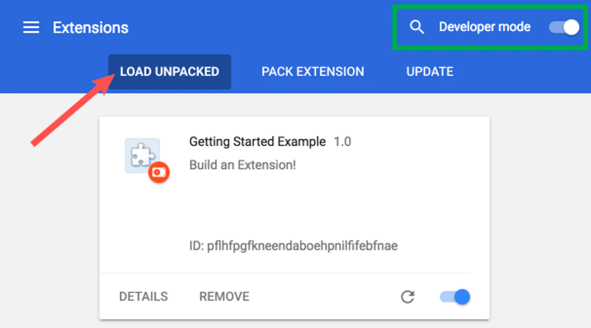

# group-savior-chrome
Small extension that allows you to save your tab groups in chrome.
## Installation
For now it's not working in Chrome Stable version due to the new API still in beta,
so to work with this extension you will need **Chrome Dev channel or newer**.

 * To install the extension click the Chrome menu icon and select Extensions from the Tools menu. 
 * Ensure that the "Developer mode" checkbox in the top right-hand corner is checked.
 * Click "Load Unpacked" and select the directory of extension you have downloaded.

## Technologies
React + Typescript + Parcel-bundler

